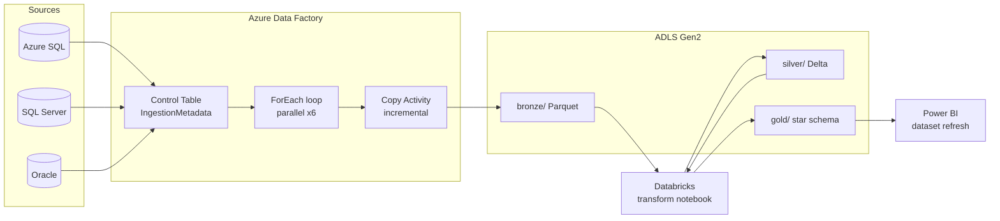

# Azure ADF — Incremental ETL Pipeline

> Metadata-driven Azure Data Factory pipeline implementing the classic **Source → ADF → Data Lake → Power BI** pattern, with incremental (watermark/CDC) loading, parallel processing, error handling, monitoring, and a Databricks transform step that builds the curated model consumed by Power BI.


---

## Flow: Source → ADF → Data Lake → Power BI



See the pipeline canvas: [`docs/pipeline-canvas.svg`](docs/pipeline-canvas.svg)

## Repository structure

```
03-Azure-ADF-ETL-Pipeline/
├── README.md
├── pipelines/
│   ├── PL_Master_Orchestrator.json      # daily: ingest → DQ → refresh PBI
│   └── PL_Ingest_Metadata_Driven.json   # the metadata-driven loop
├── datasets/
│   ├── DS_AzureSql_Control.json
│   ├── DS_AzureSql_Source.json          # parameterized (schema, table)
│   └── DS_ADLS_Bronze_Parquet.json      # parameterized (sinkPath)
├── linkedServices/
│   ├── LS_AzureSqlDb.json               # Managed Identity auth
│   ├── LS_ADLS_Gen2.json
│   ├── LS_Databricks.json
│   └── LS_KeyVault.json
└── docs/
    ├── pipeline-canvas.svg              # ADF canvas "screenshot"
    ├── etl-explanation.md
    └── monitoring.md
```

## Why metadata-driven?

One pipeline handles every source. Onboarding a new table is a **single INSERT** into `control.IngestionMetadata` — no new pipeline, no redeploy. The `ForEach` reads that table and processes entities in parallel.

```sql
INSERT INTO control.IngestionMetadata
(entity_id, source_schema, source_table, sink_path, load_type, watermark_column, watermark_value, is_active)
VALUES
(7, 'dbo', 'Transactions', 'finance/transactions', 'INCREMENTAL', 'ModifiedDate', '2020-01-01', 1);
```

## Incremental loading

| Element | Detail |
|---------|--------|
| Watermark | `WHERE ModifiedDate > @last_watermark`; advanced only after a validated copy |
| CDC option | SQL Server CDC supported via change-tracking source query |
| Partitioned copy | `DynamicRange` partitioning parallelizes large extracts |
| Consistency | `validateDataConsistency = true` on the Copy activity |
| Idempotency | watermark advance is transactional via `usp_UpdateWatermark` |

## Error handling

- Copy activity: **retry 3× exponential**; on terminal failure the **fail path** routes to `Log_DeadLetter` (stored proc) capturing the error and entity.
- Master orchestrator: `MailOnFailure` notification on the Power BI refresh; `elapsedTimeMetric` SLA alarm at 3h.

## Monitoring

See [`docs/monitoring.md`](docs/monitoring.md) — run-log table, Azure Monitor alerts, and the metrics tracked (rows copied, duration, failures, throughput).

## Detailed walkthrough

See [`docs/etl-explanation.md`](docs/etl-explanation.md) for an activity-by-activity explanation and the control/run-log schemas.
