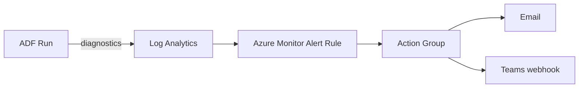

# Monitoring & Observability

## Run-log table

Every entity run writes a record for auditability and trend analysis.

```sql
CREATE TABLE control.PipelineRunLog (
    run_id          VARCHAR(50),
    entity_id       INT,
    pipeline_name   VARCHAR(128),
    started_at      DATETIME2,
    ended_at        DATETIME2,
    status          VARCHAR(20),     -- SUCCEEDED | FAILED
    rows_copied     BIGINT,
    data_read_mb    DECIMAL(12,2),
    duration_sec    INT,
    throughput_mbps DECIMAL(10,2)
);
```

## What's monitored

| Metric | Source | Alert threshold |
|--------|--------|-----------------|
| Pipeline failure | ADF run status | any failure → email + Teams |
| SLA breach | `elapsedTimeMetric` (3h) | exceeded → Azure Monitor alert |
| Rows copied = 0 unexpectedly | run-log | warn (possible source/watermark issue) |
| Throughput drop | run-log trend | > 40% slower than 7-day avg |
| Dead-letter entries | `PipelineFailureLog` | any new row → triage |

## Azure Monitor / Log Analytics

ADF diagnostic settings stream `PipelineRuns`, `ActivityRuns`, and `TriggerRuns` to a Log Analytics workspace. Example KQL for failed activities in the last day:

```kusto
ADFActivityRun
| where TimeGenerated > ago(1d)
| where Status == "Failed"
| project TimeGenerated, PipelineName, ActivityName, ErrorMessage
| order by TimeGenerated desc
```

## Operational dashboard

A small Power BI report over `PipelineRunLog` shows: daily success rate, rows ingested per source, average duration trend, and an open-failures list — so the data team sees pipeline health alongside the business reports it feeds.

## Alerting flow


